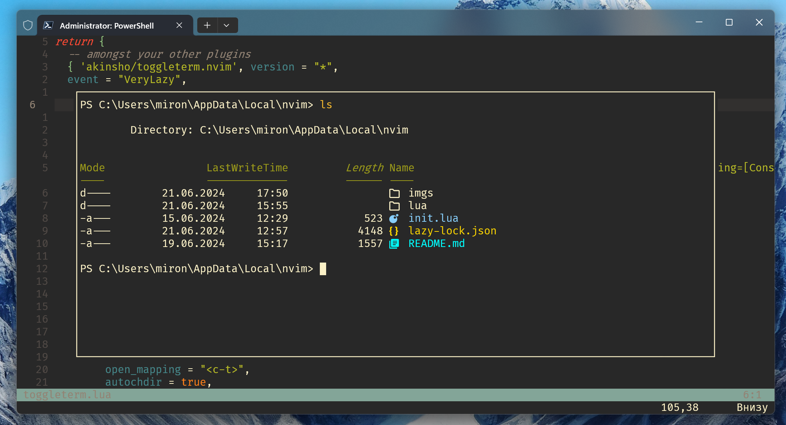
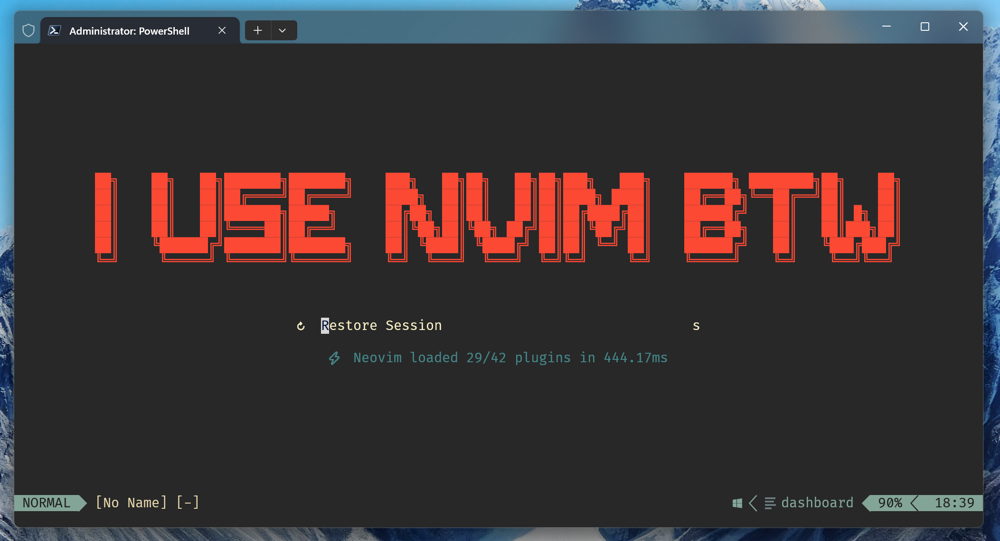

# My neovim configuration 🤗

#### To understand some of my settings, you may need to know that I use the following keymaps in the system

<table>
    <tr>
        <th>Select</th>
        <th>To</th>
        <th>Commentary</th>
    <tr>
    <tr>
        <td>CAPS</td>
        <td>ESC</td>
        <td>Game changer. Every vim user has to do this</td>
    <tr>
        <td>ALT</td>
        <td>CTRL</td>
        <td>
            Of course, I had to relearn CTRL + V, CTRL + C, CTRL + A, etc but it was worth it. But what about the alt?
            I did not change the left control to the alt. Instead, I use the right alt. It's more ergonomic because I don't have to leave homerow.
            So, I use the left alt as a control, and the right alt as the actual alt
        </td>
    </tr>
    <tr>
        <td>CTRL + M</td>
        <td>CAPS</td>
        <td>Here and below, I press alt physically on the keyboard instead of ctrl because of the above keymaps</td>
        <td></td>
    </tr>
    <tr> <td>CTRL + TAB</td>
        <td>ALT + TAB</td>
        <td>ALT + TAB was the only combination where I used ALT key lol</td>
    </tr>
    <tr>
        <td>CTRL + J</td>
        <td>↓</td>
        <td></td>
    </tr>
    <tr>
        <td>CTRL + K</td>
        <td>↑</td>
        <td></td>
    </tr>
    <tr>
        <td>CTRL + H</td>
        <td>←</td>
        <td></td>
    </tr>
    <tr>
        <td>CTRL + L</td>
        <td>→</td>
        <td></td>
    </tr>
    <tr>
        <td>CTRL + B</td>
        <td>CTRL + ←</td>
        <td></td>
    </tr>
    <tr>
        <td>CTRL + E</td>
        <td>CTRL + →</td>
        <td></td>
    </tr>
</table>

### Colorscheme 😻 

### File Tree 🌳
 

### Toggle Term 👽
 

### Telescope 🔭
 

### Dashboard 😎
 

### Favourite keymaps ✨
1. \<C-h> and \<C-l> (Switch placeholders snippets)
2. g. (Goto prev buffer)
3. \<leader>d (Debug mode. See below)

#### TODO ⚒️ 
- [ ] Add a description and my opinion to each plugin above
